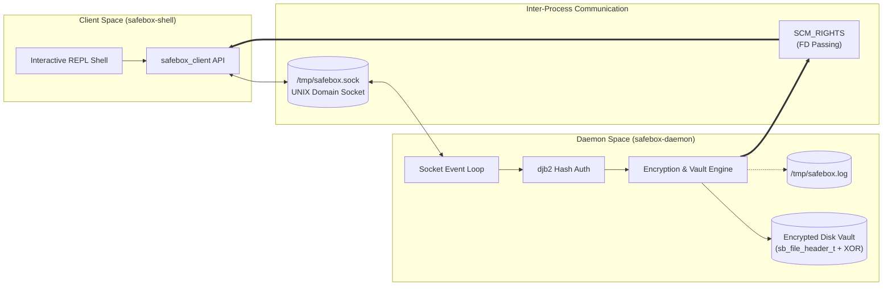

<div align="center">

# 🔒 SafeBox — POSIX Secure Storage Daemon & Client Shell

**A lightweight, secure file vault daemon in C utilizing UNIX Domain Sockets, SCM_RIGHTS file descriptor passing, and symmetric XOR obfuscation.**

Developed for **CI-3825: Operating Systems I** at [Universidad Simón Bolívar (USB)](https://www.usb.ve/).

[](https://en.wikipedia.org/wiki/C_(programming_language))
[](https://pubs.opengroup.org/onlinepubs/9699919799/)
[](https://man7.org/linux/man-pages/man7/unix.7.html)
[](#licencia)

</div>

---

## 📌 Overview

**SafeBox** is a POSIX-compliant client-server file vault designed to store and manage confidential files securely in Linux environments. The system consists of two primary components:
1. `safebox-daemon`: A background service that manages the encrypted on-disk storage directory, enforces password authentication via `djb2` hashing, handles atomic logging, and communicates via UNIX domain sockets (`/tmp/safebox.sock`).
2. `safebox-shell`: An interactive REPL client allowing users to authenticate, list stored files, upload (`put`), download (`get`), and delete (`del`) records securely.

### Key Highlights
- **Zero-Copy File Descriptor Passing (`SCM_RIGHTS`):** When retrieving files (`get`), the daemon transfers anonymous file descriptors directly to the client process via socket ancillary control messages (`sendmsg`/`recvmsg`), preventing intermediate disk leakage.
- **Atomic Concurrency-Safe Logging:** Non-blocking atomic event logger appending to `/tmp/safebox.log` using `write()` with `O_APPEND` guarantee under `PIPE_BUF`.
- **Custom Cryptographic Disk Packaging:** Files are sealed with an 8-byte binary header, `SBX!` magic identifier validation, and multi-byte cyclic XOR encryption.

---

## 🏛️ System Architecture



---

## 🔐 Protocol & Binary Format

### 1. On-Disk Binary Header (`sb_file_header_t`)
Every encrypted file stored in the vault directory is prefixed by a packed 8-byte binary header:

```
 0                   1                   2                   3
 0 1 2 3 4 5 6 7 8 9 0 1 2 3 4 5 6 7 8 9 0 1 2 3 4 5 6 7 8 9 0 1
+-+-+-+-+-+-+-+-+-+-+-+-+-+-+-+-+-+-+-+-+-+-+-+-+-+-+-+-+-+-+-+-+
|  Version (1B) |               Payload Size (4B)               |
+-+-+-+-+-+-+-+-+-+-+-+-+-+-+-+-+-+-+-+-+-+-+-+-+-+-+-+-+-+-+-+-+
|                        Reserved (3B)                          |
+-+-+-+-+-+-+-+-+-+-+-+-+-+-+-+-+-+-+-+-+-+-+-+-+-+-+-+-+-+-+-+-+
|       Encrypted Payload = XOR("SBX!" + Content, Key)          |
|                             ...                               |
+-+-+-+-+-+-+-+-+-+-+-+-+-+-+-+-+-+-+-+-+-+-+-+-+-+-+-+-+-+-+-+-+
```

- **Version (1 Byte):** Protocol version indicator (`0x01`).
- **Payload Size (4 Bytes, Little-Endian):** Total length of ciphertext.
- **Reserved (3 Bytes):** Zero-padded buffer reserved for initialization vectors (IV).
- **Magic Marker (`SBX!`):** Prepended to plain text prior to XOR ciphering. Verifies decryption integrity upon extraction.

### 2. Protocol Opcodes & Responses

| Opcode | Hex | Description |
| :--- | :---: | :--- |
| `SB_OP_LIST` | `0x01` | Retrieves the catalog of active files in the vault. |
| `SB_OP_GET` | `0x02` | Fetches file data using an anonymous file descriptor passed via socket. |
| `SB_OP_PUT` | `0x03` | Encrypts and persists a new file in the vault. |
| `SB_OP_DEL` | `0x04` | Securely removes an existing file from disk. |
| `SB_OP_BYE` | `0x05` | Gracefully closes the client session. |

**Response Status Codes:**
- `0x00 (SB_OK)`: Operation executed successfully.
- `0x01 (SB_ERR_AUTH)`: Authentication failed (`djb2` mismatch).
- `0x02 (SB_ERR_NOFILE)`: Requested file does not exist in vault.
- `0x03 (SB_ERR_CORRUPT)`: Magic validation failure (`SBX!` not detected).
- `0x04 (SB_ERR_EXISTS)`: Destination file already present.
- `0x05 (SB_ERR_IO)`: Generic I/O or filesystem error.

---

## 🛠️ Build & Installation

### Prerequisites
- GCC / Clang with C99 support.
- POSIX-compliant operating system (Linux / WSL).
- GNU Make.

### Compilation
The project includes a multi-target `Makefile`:

```bash
# Clone the repository
git clone https://github.com/soyvistorrr/safebox.git
cd safebox

# Build daemon and client binaries
make
```

Binaries generated:
- `safebox-daemon`
- `safebox-shell`

---

## 🚀 Usage Guide

### 1. Launch the Vault Daemon
Start the daemon specifying the target vault directory and the master password:

```bash
./safebox-daemon /path/to/my_vault "MySuperSecretPassword"
```

The daemon will:
- Initialize the target vault directory if it doesn't exist.
- Bind the UNIX domain socket to `/tmp/safebox.sock`.
- Record its PID in `/tmp/safebox.pid`.
- Start streaming logs to `/tmp/safebox.log`.

### 2. Connect via the Interactive Shell
In another terminal session:

```bash
./safebox-shell
```

You will be prompted for the vault password:
```text
Password: ********************
[safebox]> help
Commands:
  list                 List all stored files in vault
  put <local> <vault>  Upload and encrypt file into vault
  get <vault> <local>  Retrieve and decrypt file from vault
  del <vault>          Delete a file from vault
  bye                  Exit shell
```

### 3. Example Session
```text
[safebox]> put 01_himno.txt himno_nacional.txt
[OK] File uploaded and encrypted successfully.

[safebox]> list
--- Stored Files ---
1. himno_nacional.txt (4,096 bytes)

[safebox]> get himno_nacional.txt downloaded_himno.txt
[OK] Received anonymous FD via SCM_RIGHTS. File written to disk.

[safebox]> del himno_nacional.txt
[OK] File removed.

[safebox]> bye
Exiting.
```

---

## 🧪 Automated Testing Suite

SafeBox includes a complete suite of automated Bash test scripts located in `tests/`:

```bash
# Run basic operational tests (Auth, PUT, GET, LIST, DEL)
bash tests/test_basic.sh

# Run advanced tests (Tampering detection, invalid magic, concurrency)
bash tests/test_advanced.sh

# Run master test suite
bash tests/test_master.sh
```

---

## 👤 Author
**Victor Hernández**  
- Computer Engineering Student @ [Universidad Simón Bolívar (USB)](https://www.usb.ve/)
- GitHub: [@soyvistorrr](https://github.com/soyvistorrr)
- LinkedIn: [Victor Hernández](https://linkedin.com/in/soyvistorr3009)
- Email: victormhernandeza3009@gmail.com
